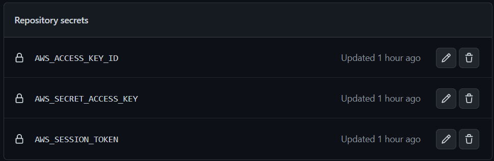
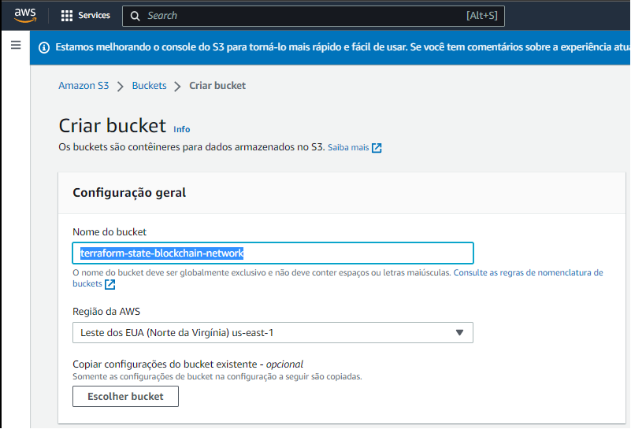

# Infra Reusable

## AMP

## How to begin

### Configuring the AWS Cloud Provider

1. Enter the AWS account credentials (environment variables `AWS_ACCESS_KEY_ID`, `AWS_SECRET_ACCESS_KEY` and `AWS_SESSION_TOKEN`) in the GitHub Secrets of this repository (Settings -> Secrets -> Actions):

2. Create an s3 bucket in region `us-east-1` with the name described in the backend.tf file (example `terraform-state-amp-network`):

## Development in this repository

This repository uses GitHub Actions for the CD/CI stream. Following the settings in the main branch (Settings -> Code and automation, Branchs -> Branc protection rules, main):

1. **Require a pull request before merging**
When enabled, all commits must be made to a non-protected branch and submitted via a pull request before they can be merged into a branch that matches this rule.

2. **Require status checks to pass before merging (for action terraform-validate)**
Choose which status checks must pass before branches can be merged into a branch that matches this rule. When enabled, commits must first be pushed to another branch, then merged or pushed directly to a branch that matches this rule after status checks have passed.

3. **Require branches to be up to date before merging**
This ensures pull requests targeting a matching branch have been tested with the latest code. This setting will not take effect unless at least one status check is enabled (see below).

### Project folder structure

### Branch feature/***

For the development of new features, create a branch following the pattern: `feature/***` and perform the pull that will perform the initial configuration of terraform validations using the action `.github/validate-terraform.yml`. At the end of the validation, the pull request to the main branch is automatically performed.

### Branch main

When approving an automatically opened pull request, the `.github/apply-destroy-terraform.yml` action is triggered. Which checks whether terraform should be applied (contents of the `destroy.yml` file with the content `destroy: false`) or destroyed (contents of the `destroy.yml` file with the content `destroy: true`).

  

## Documentation

### Useful links:

1. [Enabling route53 to manage Registro.br domain](https://medium.com/@sergioafonsojr/como-configurar-um-dom%C3%ADnio-com-br-no-registro-br-e-route-53-c971d97af63c);
2. [How to Set Up @Zoho Mail on an AWS Route 53 Domain](https://www.youtube.com/watch?v=Y2bfzH4iBvg);